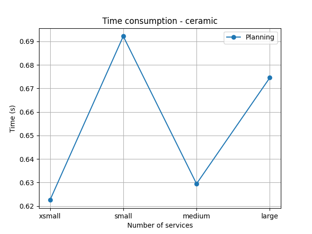
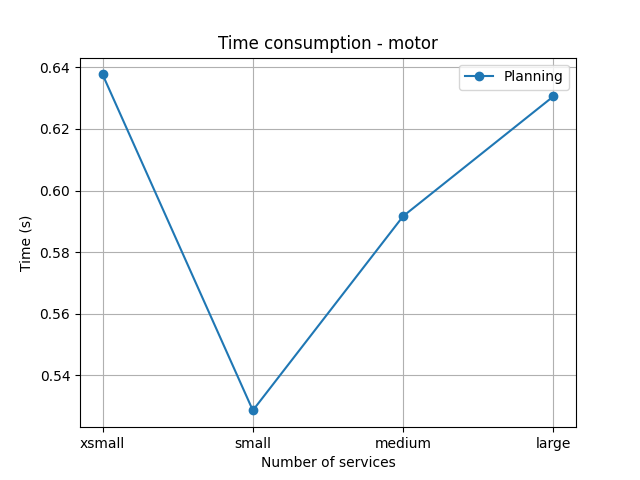

# Orchestration of services in Smart Manufacturing through automated synthesis - Deterministic instance planning approach

Repository containing the case studies and the experimental results of the deterministic instance planning approach (classical planning) for the paper "Orchestration of services in Smart Manufacturing through automated synthesis".

## Experiments

The experiments can be replicated using Docker.

### Use the Docker image

1. Build the image from the [Dockerfile](Dockerfile):
  ```sh
  docker build -t planning_controller .
  ```

2. Run a new container and open a terminal from the created image:
  ```sh
  docker run planning_controller bash
  ```

3. Set up the configuration file needed for the controller.

4. Run the controller:
  ```sh
  python3 main.py 
  ```

5. When the controller finishes its execution, it produces two log files (for each run) in the `experimental_results` folder. These files represent:
- `<timestamp>_profiling_<case_study>_<size>`: contains the time consumption of the plan computation
- `<timestamp>_profiling_downward_<case_study>_<size>`: contains the memory consumption of the plan computation

#### Configuration file
The configuration file  `config.json` contains basic information needed to run the experiments. 

It contains the basic information needed to run the experiments. The JSON key ``mode`` accept the values ``[plan]`` (it can be skipped), the key ``size`` accepts ``[xsmall, small, medium, large]`` values (related to the number of involved actors), the key `case_study` accepts ``["chip", "ceramic", "motor]`` values which serve to indicate which case study to use, the key `path_desc` can be skipped as it indicates to the Industrial API where the case study descriptions are.

An example with information of the key-value pairs is given below.
```json
{
    "mode": "plan",
    "size": "xsmall",
    "case_study": "chip",
    "path_desc": "src"
}
```

## Evaluation Results

Evaluation results of the experiments can be found in [eval_utils](eval_utils/). The [experimental_results.csv](eval_utils/experimental_results.csv) file contains the aggregated results of the memory and time consumption for the three case studies.


### Chip case study

#### Memory consumption


#### Time consumption


### Ceramic case study

#### Memory consumption


#### Time consumption



### Motor case study

#### Memory consumption


#### Time consumption



## Comulative Experimental Results

Comulative results (including also policy-based approachs) are available in [cum_exp](cum_exp).

#### Time consumption


#### Memory consumption
